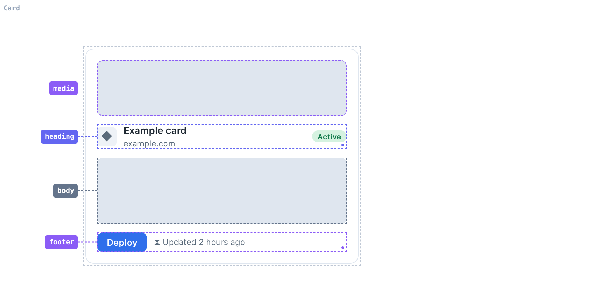
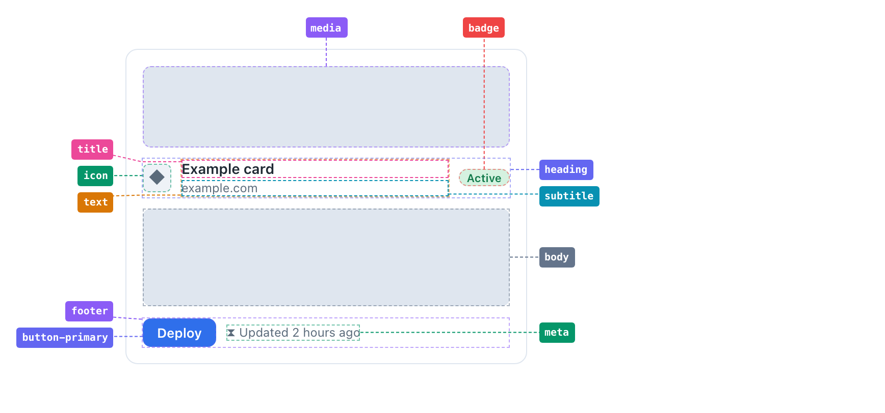
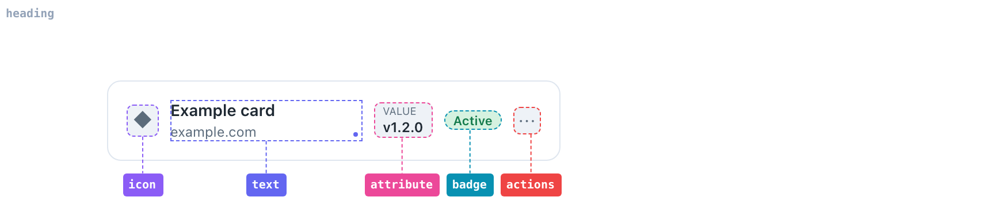

<p align="center">
  
</p>

<p align="center">
  A Storybook addon that draws anatomy diagrams for your components. Mark the
  parts with <code>data-slot</code>, set one story parameter, and every part
  gets a labelled callout in a gutter outside the frame — reached by a leader
  that <strong>provably never crosses another</strong>.
</p>

---

Design-system docs live and die by their anatomy diagrams, and today they are
drawn by hand in Figma — re-measured and re-laid-out every time a component
changes. `react-anatomy` draws them right in Storybook, from the live DOM. Turn
it on for a story and it discovers the parts, lays out the labels, routes the
leaders, and outlines each region. Nothing is hand-placed, so nothing goes stale.

<p align="center">
  
</p>

## What you get

- **Zero coupling.** The addon reads `data-slot` attributes off the rendered
  DOM. It never imports your components and never needs to know what they are.
- **Leaders that cannot cross.** Every leader leaves its region perpendicular to
  the nearest rail; because each fan on a side spans one x-interval, order is
  preserved and crossings are impossible — a geometric guarantee, not a
  heuristic.
- **Deterministic.** The placement is a pure function of the geometry, the label
  sizes, and a set of constants. Same input, identical output, every render —
  diagrams that are safe to snapshot.
- **The component never moves.** Gutters are reserved before the layout solves,
  so turning the overlay on doesn't shift the thing you're documenting by a pixel.
- **Navigable or static.** Leave it navigable and the reader drills a level at a
  time with breadcrumbs; pin a `depth` for a fixed diagram to embed in docs.

## Install

```sh
npm install @react-anatomy/storybook
```

## Setup

Register the addon's decorator in your Storybook preview. It derives the label
from the story context, so there is nothing to name by hand:

```ts
// .storybook/preview.ts
import { decorators } from "@react-anatomy/storybook/preview";

export default { decorators };
```

## Usage

Mark the parts of your component with `data-slot` — that is the entire contract:

```tsx
function Card({ children }) {
  return (
    <div>
      <div data-slot="media">{/* … */}</div>
      <div data-slot="heading">{/* … */}</div>
      <div data-slot="body">{/* … */}</div>
      <div data-slot="footer">{/* … */}</div>
    </div>
  );
}
```

Then set the `slotAnnotations` parameter on any story. `true` annotates the
outermost slots; `boundary` outlines the component's own edge:

```tsx
export const Anatomy = {
  parameters: { slotAnnotations: { boundary: true } },
  render: () => <Card>{/* … */}</Card>,
};
```

That renders the diagram above. Set `depth` to `"all"` for the full tree at once
— nested regions and all — laid out in the same non-crossing construction:

```tsx
export const AnatomyAll = {
  parameters: { slotAnnotations: { depth: "all" } },
  render: () => <Card>{/* … */}</Card>,
};
```

<p align="center">
  
</p>

Or focus on one part with `scope` — the labels route out to the sides when the
parts are packed together in a row:

```tsx
export const HeadingAnatomy = {
  parameters: { slotAnnotations: { scope: "heading" } },
  render: () => <Card>{/* … */}</Card>,
};
```

<p align="center">
  
</p>

### Parameters

Set `slotAnnotations` to `true` for the outermost slots, or to an object:

| Option     | Type                     | Default      | Description                                                                |
| ---------- | ------------------------ | ------------ | -------------------------------------------------------------------------- |
| `scope`    | `string`                 | outermost    | Annotate the slots inside the element carrying this `data-slot`.           |
| `depth`    | `number \| "all"`        | navigable    | Nesting levels to show. Omit for the drill-down; set for a static diagram. |
| `boundary` | `boolean`                | `false`      | Outline the component's own edge.                                          |
| `gutters`  | `"reserved" \| "fitted"` | `"reserved"` | `"fitted"` crops the gutters to the labels (needs a pinned `depth`).       |

The root breadcrumb is taken from the story context — the `scope` when there is
one, otherwise the last segment of the story title.

## Working in the repo

```sh
pnpm install
pnpm build      # build the packages
pnpm test       # the placement + collection suites (vitest)
pnpm lint       # eslint (--max-warnings=0) + prettier + knip + depcheck
pnpm storybook  # the playground, consuming the built packages
```

Requires Node 24 and pnpm 11.8.0 (provisioned via `devEngines`).

MIT licensed.
